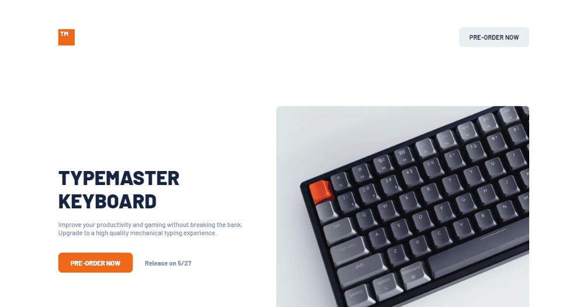

# Desafio Typemaster Landing Page - Frontend-Mentor

Este é um desafio de uma landing page para o teclado TypeMaster, proposto pelo site Frontend-Mentor.

## Tabela de Conteúdos

- [Visão Geral](#visão-geral)
    - [Imagens](#imagens)
    - [Link da página](#link)
- [Processo](#processo)
    - [Linguagens utilizadas](#linguagens-utilizadas)
    - [O que aprendi](#o-que-aprendi)
    - [Possíveis evoluções](#possíveis-evoluções)
- [Autor](#autor)

## Visão-geral

### Imagens

<br>

````
Versão de Desktop
````

   

<br>

````
Versão Mobile

````

 

<br>

````
Versão Tablet

````

 

### Link

- Página no GitHub Pages: <a href="https://julio-mansan2.github.io/typemaster-landing-page/">Clique aqui!</a>

## Processo

### Linguagens utilizadas

<br>

- Marcações semânticas de HTML5
- Propriedades de customização do CSS3
- Estruturas de JavaScript

<br>

### O que aprendi

<br>

- Aplicar mix-blend-mode a certos elementos:

````css

.main .orange-img::before {
    content: '';
    height: 100%;
    width: 100%;
    background: var(--orange-darken);
    position: absolute;
    border-radius: 0.625rem;
    mix-blend-mode: multiply;
}

````

<br>

### Possíveis evoluções

<br>

Pela facilidade do projeto, ele pôde ser construído sem muitos problemas.

<br>

## Autor

GitHub - <a href="https://github.com/julio-mansan2">julio-mansan2</a> <br>
Front-end Mentor - <a href="https://www.frontendmentor.io/profile/julio-mansan2">julio-mansan2</a> <br>
LinkedIn - <a href="https://www.linkedin.com/in/j%C3%BAlio-a-mansan-3415a7249/">Júlio A.</a> <br>
